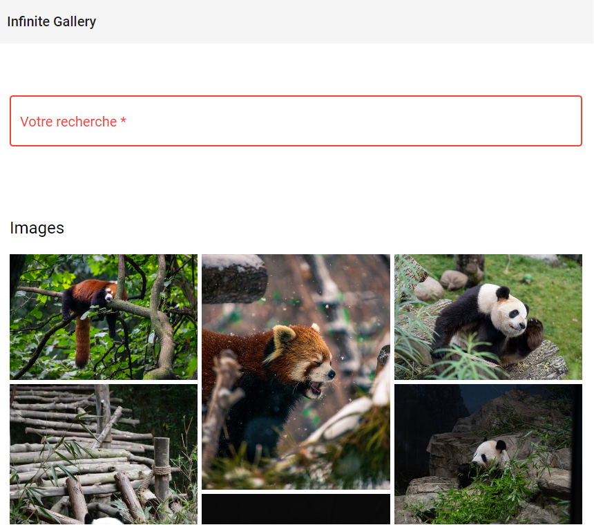

[![Contributors][contributors-shield]][contributors-url] [![Forks][forks-shield]][forks-url] [![Stargazers][stars-shield]][stars-url] [![Issues][issues-shield]][issues-url]

# Unsplash clone 

Moteur de recherche d'images basé sur l'API d'Unsplash | Angular 

## Features


- Connection à une API externe
- Scroll Infini
- Notions Angular (Resolvers, Form, Lazy loading)



<a href='https://www.youtube.com/watch?v=c4FoYfU7N2c'></br>


## 🔨 Technologies 

* Frontend 
    - Framework **Angular**
    - **SCSS**
    - Material Angular
    - npm ngx-infinite-scroll

## 🏗️ Installation


- Cloner ce projet 
- Assurer vous d'avoir Node et Angular d'installés 

    ### 🔍 Frontend
    
Le projet a été généré avec Angular CLI 14.1.1

- `npm install`
- Run `ng serve` for a dev server. Navigater vers http://localhost:4200/

```
environment variable (Key API unsplash pour les développeurs)

UnsplashLike-Angular/src/environments/

export const environment = {
  production: false,
  key:""
};
```


## 📬 Contact 

COUHE Jean-philippe - pro@jean-philippecouhe.fr

[](mailto:pro@jeanphilippecouhe.fr)
 [](https://www.linkedin.com/in/jean-philippe-couhe/) 
 


<!-- MARKDOWN LINKS & IMAGES -->
<!-- https://www.markdownguide.org/basic-syntax/#reference-style-links -->
[contributors-shield]: https://img.shields.io/github/contributors/jpcouhe/UnsplashLike-Angular.svg?style=flat-square
[contributors-url]: https://github.com/jpcouhe/UnsplashLike-Angular/graphs/contributors
[forks-shield]: https://img.shields.io/github/forks/jpcouhe/UnsplashLike-Angular.svg?style=flat-square
[forks-url]: https://github.com/jpcouhe/UnsplashLike-Angular/network/members
[stars-shield]: https://img.shields.io/github/stars/jpcouhe/UnsplashLike-Angular.svg?style=flat-square
[stars-url]: https://github.com/jpcouhe/UnsplashLike-Angular/stargazers
[issues-shield]: https://img.shields.io/github/issues/jpcouhe/UnsplashLike-Angular.svg?style=flat-square
[issues-url]: https://github.com/jpcouhe/UnsplashLike-Angular/issues
[product-screenshot]: example.jpg
[youtube-screenshot]: youtube.png
